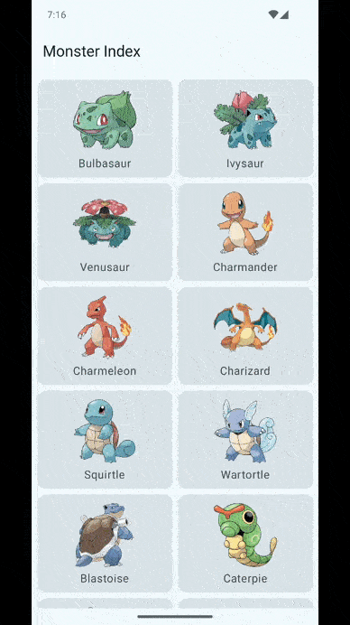

# MonsterIndex

MonsterIndex is an offline-first Pokémon Encyclopedia app developed to showcase my Android development skills. This project highlights my ability to integrate a REST API with local storage for offline functionality, while utilizing Jetpack Compose for a modern, intuitive UI and Kotlin for enhanced code safety and productivity. I focused on implementing a scalable app architecture and dependency injection to ensure maintainability, testing efficiency, and a robust, future-proof app that is ready for team collaboration and growth.

# Features

**Offline-first:** features a robust offline-first design, ensuring the app remains fully functional even without an internet connection. By integrating a REST API with local data storage, it seamlessly syncs Pokémon data when online and provides uninterrupted access when offline. This approach not only enhances user experience but also showcases best practices in developing reliable and resilient applications for real-world use.

**Infinite scrolling:** incorporates infinite scrolling, enabling users to seamlessly browse the entire Pokémon list without interruptions. This feature optimizes performance by loading data dynamically as users scroll, ensuring a smooth and efficient user experience even with large datasets. It highlights modern UI design principles and efficient data handling techniques.

